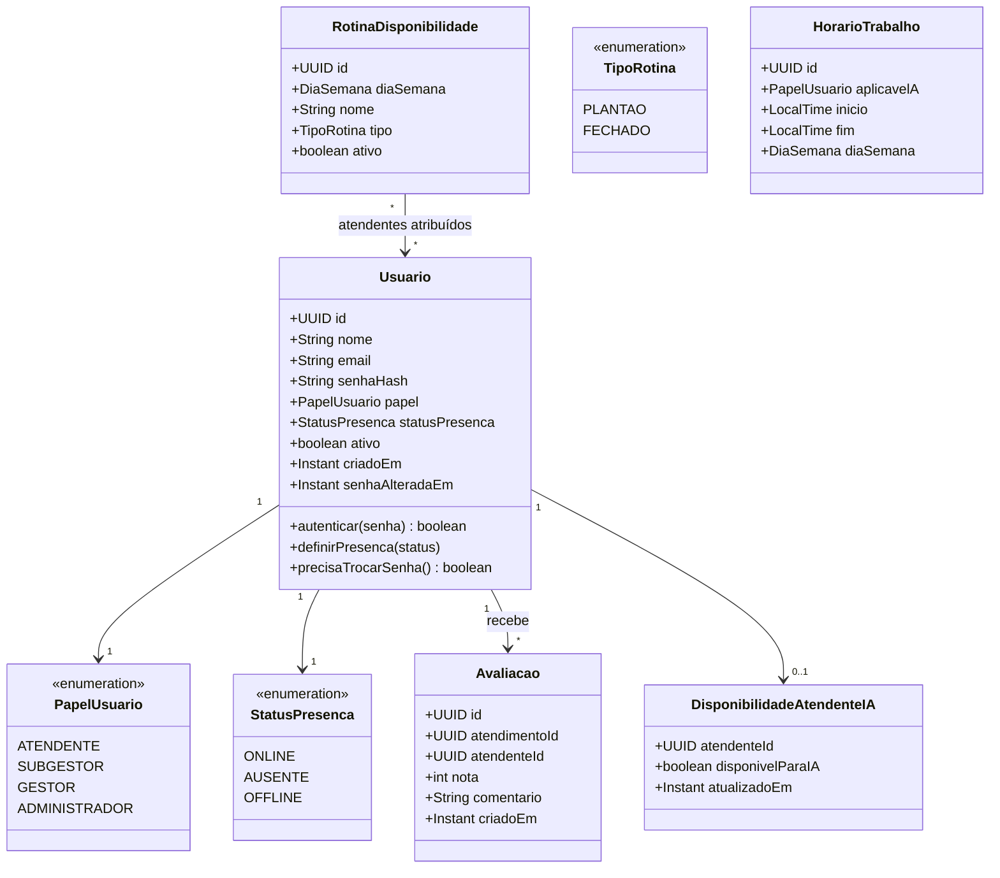
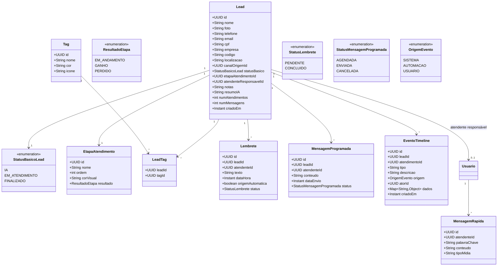
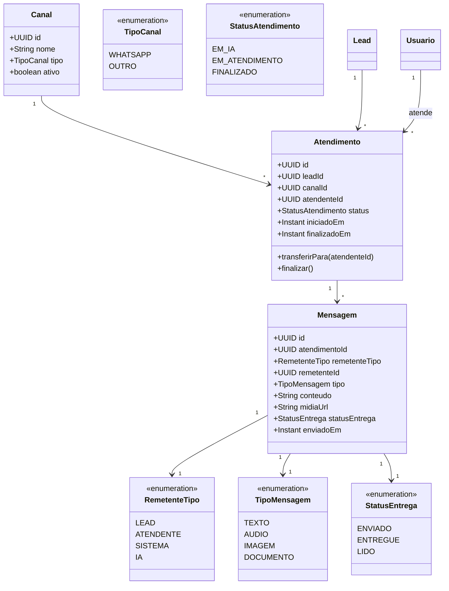
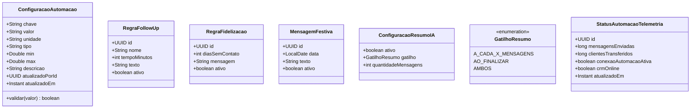
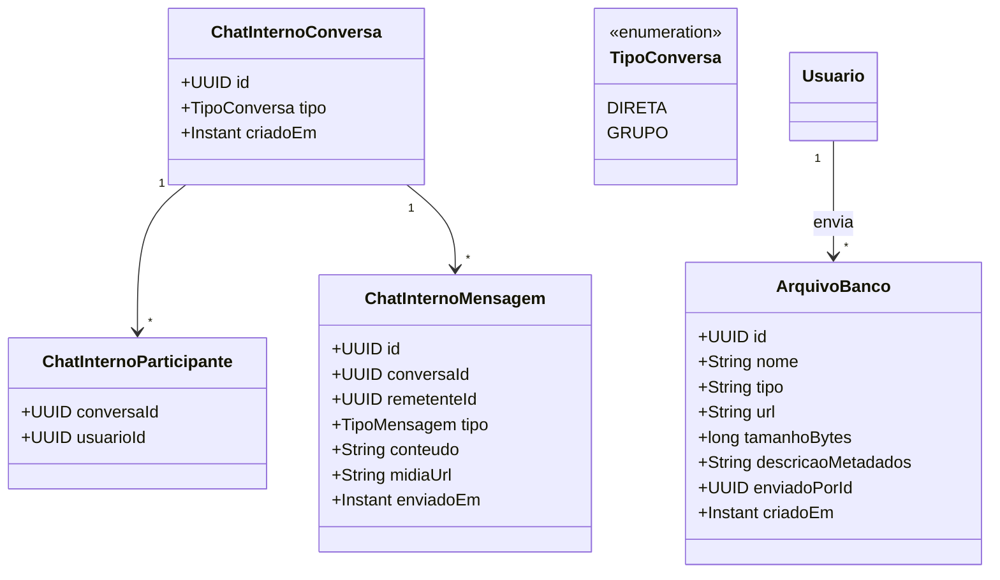

# 02. Modelo de Domínio — Diagrama de Classes

Diagrama dividido por módulo (bounded context) para legibilidade. Renderiza em qualquer visualizador Mermaid (GitHub, Notion, VS Code + extensão Mermaid).

Convenção: `+` público, `#` protegido/somente leitura externa. Enums marcados com `<<enumeration>>`.

## 1. Equipe (Usuários, Papéis, Presença)

*Cobre RF-CRM-01/02/46/47/54/74/75/81.*

## 2. CRM Core (Lead, Tags, Agenda, Lembretes, Mensagens Programadas)

`Lead.codigo` é identificador interno numérico da instância (somente dígitos, até 20, zeros à esquerda preservados). Opcional; vazio na edição vira `null`. Não é campo customizado: precisa aparecer no card da lista de Atendimentos, e `dadosCustomizados` não entra em projeção de listagem. A Agenda (`LeadResumo`) não o carrega. Normalização em `CodigoDoLead`; persistência em `lead.codigo` (V47).

*Cobre RF-CRM-14 a 19, 23 a 29, 48 a 53, 57 a 64, 70/71/77.*

## 3. Atendimento (Conversas e Mensagens)

*Cobre RF-CRM-06 a 22, 65 a 69 e a RNF-CRM-01 (ultra-regra de estabilidade).*

## 4. Campanhas

```mermaid
classDiagram
    class Campanha {
        +UUID id
        +String nome
        +UUID filtroPublicoId
        +Instant dataInicio
        +Instant dataFim
        +int intervaloEnvioDias
        +StatusCampanha status
        +UUID criadoPorId
        +ativar()
    }

    class StatusCampanha {
        <<enumeration>>
        RASCUNHO
        ATIVA
        PAUSADA
        ENCERRADA
    }

    class CampanhaMensagem {
        +UUID id
        +UUID campanhaId
        +int ordem
        +String conteudo
        +String tipoMidia
    }

    class CampanhaMensagemMetrica {
        +UUID id
        +UUID campanhaMensagemId
        +UUID leadId
        +boolean enviada
        +boolean visualizou
        +boolean respondeu
        +boolean entrouAtendimento
        +int numMensagensLead
        +boolean fechado
    }

    class FiltroModular {
        +UUID id
        +String nome
        +ContextoFiltro contexto
        +JsonB criterios
        +UUID criadoPorId
        +contar() int
    }

    class ContextoFiltro {
        <<enumeration>>
        ATENDIMENTOS
        AGENDA
        CAMPANHA
    }

    Campanha "1" --> "1" FiltroModular : público
    Campanha "1" --> "*" CampanhaMensagem
    CampanhaMensagem "1" --> "*" CampanhaMensagemMetrica
    CampanhaMensagemMetrica "*" --> "1" Lead
```

*Cobre RF-CRM-04/05/39 a 44.*

## 5. Automação — Configuração (fonte da verdade dos parâmetros)

*Cobre RF-CRM-34 a 38, 38a a 38e, 72 a 76 — todo parâmetro numérico/temporal da Automação vive aqui, nunca em código (RN-CRM-07).*

## 6. Chat Interno e Banco de Arquivos

*Cobre RF-CRM-45, 55, 56, 78.*

## Observações de modelagem

- **`FiltroModular`** é compartilhado entre Agenda, Atendimentos e Campanhas (RF-CRM-04/05/40) — é uma entidade própria, não duplicada por tela.
- **`EtapaAtendimento`** é uma tabela de configuração (não enum fixo em código), porque a etapa é definida pela Automação (RF-AUT-12) e pode mudar sem deploy do CRM. Seu `ResultadoEtapa` dá semântica comercial estável (`EM_ANDAMENTO`, `GANHO`, `PERDIDO`) sem deduzir venda pelo nome configurável; um índice único parcial permite no máximo uma etapa `GANHO`.
- **`ConfiguracaoAutomacao`** usa modelo chave-valor tipado deliberadamente (em vez de uma coluna por parâmetro), para satisfazer RF-CRM-38e (extensibilidade: novo parâmetro = nova linha, nunca nova coluna/deploy).
- **Enums vs. tabelas**: `PapelUsuario`, `StatusPresenca`, `TipoMensagem`, `StatusEntrega` são enums porque são estáveis e fazem parte do contrato do domínio; `EtapaAtendimento` e `Canal` são tabelas porque são geridos/expandidos por configuração (multicanal, novas etapas).
