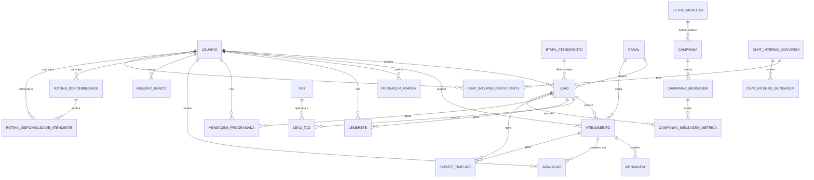

# 03. Modelo de Dados — PostgreSQL

## 1. Diagrama Entidade-Relacionamento (visão consolidada)



> Tabelas de configuração pura (`configuracao_automacao`, `regra_follow_up`, `regra_fidelizacao`, `mensagem_festiva`, `configuracao_resumo_ia`, `status_automacao_telemetria`) não têm cardinalidade relevante com o restante do modelo — são lidas pela Automação via API, por isso ficam fora do ER acima. Ver DDL completo abaixo.

## 2. Script DDL (PostgreSQL 15+)

```sql
-- =========================================================
-- Extensões
-- =========================================================
CREATE EXTENSION IF NOT EXISTS pgcrypto;   -- gen_random_uuid()
CREATE EXTENSION IF NOT EXISTS pg_trgm;    -- busca fuzzy (RF-CRM-07)

-- =========================================================
-- Tipos enumerados
-- =========================================================
CREATE TYPE papel_usuario        AS ENUM ('ATENDENTE', 'SUBGESTOR', 'GESTOR', 'ADMINISTRADOR');
CREATE TYPE status_presenca      AS ENUM ('ONLINE', 'AUSENTE', 'OFFLINE');
CREATE TYPE status_basico_lead   AS ENUM ('IA', 'EM_ATENDIMENTO', 'FINALIZADO');
CREATE TYPE status_atendimento   AS ENUM ('EM_IA', 'EM_ATENDIMENTO', 'FINALIZADO');
CREATE TYPE remetente_tipo       AS ENUM ('LEAD', 'ATENDENTE', 'SISTEMA', 'IA');
CREATE TYPE tipo_mensagem        AS ENUM ('TEXTO', 'AUDIO', 'IMAGEM', 'DOCUMENTO');
CREATE TYPE status_entrega       AS ENUM ('ENVIADO', 'ENTREGUE', 'LIDO');
CREATE TYPE status_lembrete      AS ENUM ('PENDENTE', 'CONCLUIDO');
CREATE TYPE status_msg_prog      AS ENUM ('AGENDADA', 'ENVIADA', 'CANCELADA');
CREATE TYPE status_campanha      AS ENUM ('RASCUNHO', 'ATIVA', 'PAUSADA', 'ENCERRADA');
CREATE TYPE contexto_filtro      AS ENUM ('ATENDIMENTOS', 'AGENDA', 'CAMPANHA');
CREATE TYPE tipo_rotina          AS ENUM ('PLANTAO', 'FECHADO');
CREATE TYPE dia_semana           AS ENUM ('SEG','TER','QUA','QUI','SEX','SAB','DOM');
CREATE TYPE origem_evento        AS ENUM ('SISTEMA', 'AUTOMACAO', 'USUARIO');
CREATE TYPE gatilho_resumo       AS ENUM ('A_CADA_X_MENSAGENS', 'AO_FINALIZAR', 'AMBOS');
CREATE TYPE tipo_conversa_chat   AS ENUM ('DIRETA', 'GRUPO');

-- =========================================================
-- Equipe (Usuários, Papéis, Presença, Horários)
-- =========================================================
CREATE TABLE usuario (
    id                UUID PRIMARY KEY DEFAULT gen_random_uuid(),
    nome              VARCHAR(150) NOT NULL,
    email             VARCHAR(200) NOT NULL UNIQUE,
    senha_hash        VARCHAR(255) NOT NULL,
    papel             papel_usuario NOT NULL,
    status_presenca   status_presenca NOT NULL DEFAULT 'OFFLINE',
    ativo             BOOLEAN NOT NULL DEFAULT TRUE,
    criado_em         TIMESTAMPTZ NOT NULL DEFAULT now()
);
CREATE INDEX idx_usuario_papel ON usuario (papel) WHERE ativo;

CREATE TABLE avaliacao (
    id              UUID PRIMARY KEY DEFAULT gen_random_uuid(),
    atendimento_id  UUID NOT NULL,
    atendente_id    UUID NOT NULL REFERENCES usuario(id),
    nota            SMALLINT NOT NULL CHECK (nota BETWEEN 1 AND 5),
    comentario      TEXT,
    criado_em       TIMESTAMPTZ NOT NULL DEFAULT now()
);
CREATE INDEX idx_avaliacao_atendente ON avaliacao (atendente_id);

CREATE TABLE rotina_disponibilidade (
    id          UUID PRIMARY KEY DEFAULT gen_random_uuid(),
    dia_semana  dia_semana NOT NULL,
    nome        VARCHAR(100) NOT NULL,
    tipo        tipo_rotina NOT NULL,
    ativo       BOOLEAN NOT NULL DEFAULT TRUE
);

CREATE TABLE rotina_disponibilidade_atendente (
    rotina_id     UUID NOT NULL REFERENCES rotina_disponibilidade(id) ON DELETE CASCADE,
    atendente_id  UUID NOT NULL REFERENCES usuario(id) ON DELETE CASCADE,
    PRIMARY KEY (rotina_id, atendente_id)
);

CREATE TABLE disponibilidade_atendente_ia (
    atendente_id        UUID PRIMARY KEY REFERENCES usuario(id) ON DELETE CASCADE,
    disponivel_para_ia  BOOLEAN NOT NULL DEFAULT FALSE,
    atualizado_em       TIMESTAMPTZ NOT NULL DEFAULT now()
);

CREATE TABLE horario_trabalho (
    id             UUID PRIMARY KEY DEFAULT gen_random_uuid(),
    aplicavel_a    VARCHAR(20) NOT NULL, -- 'IA' ou papel_usuario
    dia_semana     dia_semana NOT NULL,
    inicio         TIME NOT NULL,
    fim            TIME NOT NULL
);

-- =========================================================
-- Configuração (Canal, Etapa de Atendimento)
-- =========================================================
CREATE TABLE canal (
    id      UUID PRIMARY KEY DEFAULT gen_random_uuid(),
    nome    VARCHAR(50) NOT NULL UNIQUE,
    tipo    VARCHAR(30) NOT NULL, -- 'WHATSAPP', extensível
    ativo   BOOLEAN NOT NULL DEFAULT TRUE
);

CREATE TABLE etapa_atendimento (
    id          UUID PRIMARY KEY DEFAULT gen_random_uuid(),
    nome        VARCHAR(80) NOT NULL,
    ordem       SMALLINT NOT NULL,
    cor_visual  VARCHAR(20)
);
CREATE UNIQUE INDEX idx_etapa_ordem ON etapa_atendimento (ordem);

-- =========================================================
-- CRM Core (Lead, Tags, Lembretes, Mensagens Programadas)
-- =========================================================
CREATE TABLE lead (
    id                        UUID PRIMARY KEY DEFAULT gen_random_uuid(),
    nome                      VARCHAR(150) NOT NULL,
    foto_url                  TEXT,
    telefone                  VARCHAR(30),
    email                     VARCHAR(200),
    cpf                       VARCHAR(14),
    empresa                   VARCHAR(150),
    localizacao               VARCHAR(200),
    canal_origem_id           UUID REFERENCES canal(id),
    status_basico             status_basico_lead NOT NULL DEFAULT 'IA',
    etapa_atendimento_id      UUID REFERENCES etapa_atendimento(id),
    atendente_responsavel_id  UUID REFERENCES usuario(id),
    notas                     TEXT,
    resumo_ia                 TEXT,
    num_atendimentos          INT NOT NULL DEFAULT 0,
    num_mensagens             INT NOT NULL DEFAULT 0,
    criado_em                 TIMESTAMPTZ NOT NULL DEFAULT now()
);

-- Isolamento de agenda (RN-CRM-01) e listagens por papel
CREATE INDEX idx_lead_atendente ON lead (atendente_responsavel_id);
CREATE INDEX idx_lead_etapa ON lead (etapa_atendimento_id);
-- Listas "Pendentes"/"Ativos" (RF-CRM-20/21) filtram por status_basico com muita frequência
CREATE INDEX idx_lead_status_basico ON lead (status_basico) WHERE status_basico <> 'FINALIZADO';
-- Busca por nome/telefone/cpf (RF-CRM-07)
CREATE INDEX idx_lead_nome_trgm ON lead USING gin (nome gin_trgm_ops);
CREATE INDEX idx_lead_telefone ON lead (telefone);
CREATE INDEX idx_lead_cpf ON lead (cpf);

CREATE TABLE tag (
    id      UUID PRIMARY KEY DEFAULT gen_random_uuid(),
    nome    VARCHAR(60) NOT NULL UNIQUE,
    cor     VARCHAR(20) NOT NULL,
    icone   VARCHAR(60)
);

CREATE TABLE lead_tag (
    lead_id  UUID NOT NULL REFERENCES lead(id) ON DELETE CASCADE,
    tag_id   UUID NOT NULL REFERENCES tag(id) ON DELETE CASCADE,
    PRIMARY KEY (lead_id, tag_id)
);
CREATE INDEX idx_lead_tag_tag ON lead_tag (tag_id); -- para métricas por tag (RF-CRM-49)

CREATE TABLE lembrete (
    id                 UUID PRIMARY KEY DEFAULT gen_random_uuid(),
    lead_id            UUID REFERENCES lead(id) ON DELETE CASCADE,
    atendente_id       UUID NOT NULL REFERENCES usuario(id),
    texto              TEXT NOT NULL,
    data_hora          TIMESTAMPTZ NOT NULL,
    origem_automatica  BOOLEAN NOT NULL DEFAULT FALSE,
    status             status_lembrete NOT NULL DEFAULT 'PENDENTE'
);
CREATE INDEX idx_lembrete_atendente ON lembrete (atendente_id, status);

CREATE TABLE mensagem_programada (
    id             UUID PRIMARY KEY DEFAULT gen_random_uuid(),
    lead_id        UUID NOT NULL REFERENCES lead(id) ON DELETE CASCADE,
    atendente_id   UUID NOT NULL REFERENCES usuario(id),
    conteudo       TEXT NOT NULL,
    data_envio     TIMESTAMPTZ NOT NULL,
    status         status_msg_prog NOT NULL DEFAULT 'AGENDADA'
);
CREATE INDEX idx_msg_prog_atendente ON mensagem_programada (atendente_id, status);
CREATE INDEX idx_msg_prog_envio ON mensagem_programada (data_envio) WHERE status = 'AGENDADA';

CREATE TABLE mensagem_rapida (
    id             UUID PRIMARY KEY DEFAULT gen_random_uuid(),
    atendente_id   UUID NOT NULL REFERENCES usuario(id) ON DELETE CASCADE,
    palavra_chave  VARCHAR(60) NOT NULL,
    conteudo       TEXT NOT NULL,
    tipo_midia     VARCHAR(30)
);
CREATE UNIQUE INDEX idx_msg_rapida_atendente_chave ON mensagem_rapida (atendente_id, palavra_chave);

CREATE TABLE evento_timeline (
    id              UUID PRIMARY KEY DEFAULT gen_random_uuid(),
    lead_id         UUID NOT NULL REFERENCES lead(id) ON DELETE CASCADE,
    atendimento_id  UUID,
    tipo            VARCHAR(60) NOT NULL,
    descricao       TEXT NOT NULL,
    origem          origem_evento NOT NULL,
    criado_em       TIMESTAMPTZ NOT NULL DEFAULT now()
);
CREATE INDEX idx_evento_timeline_lead ON evento_timeline (lead_id, criado_em DESC);

-- =========================================================
-- Atendimento (Conversas e Mensagens) — maior volume de escrita
-- =========================================================
CREATE TABLE atendimento (
    id             UUID PRIMARY KEY DEFAULT gen_random_uuid(),
    lead_id        UUID NOT NULL REFERENCES lead(id),
    canal_id       UUID REFERENCES canal(id),
    atendente_id   UUID REFERENCES usuario(id),
    status         status_atendimento NOT NULL DEFAULT 'EM_IA',
    iniciado_em    TIMESTAMPTZ NOT NULL DEFAULT now(),
    finalizado_em  TIMESTAMPTZ
);
CREATE INDEX idx_atendimento_lead ON atendimento (lead_id);
CREATE INDEX idx_atendimento_atendente_status ON atendimento (atendente_id, status);

-- Tabela particionada por mês: volume alto (RNF-CRM-08, ~5 mil atendimentos/mês
-- e múltiplas mensagens por atendimento) — particionamento mantém índices pequenos
-- e permite arquivar/mover partições antigas sem travar a tabela ativa.
CREATE TABLE mensagem (
    id                UUID NOT NULL DEFAULT gen_random_uuid(),
    atendimento_id    UUID NOT NULL REFERENCES atendimento(id),
    remetente_tipo    remetente_tipo NOT NULL,
    remetente_id      UUID,
    tipo              tipo_mensagem NOT NULL,
    conteudo          TEXT,
    midia_url         TEXT,
    midia_metadados   JSONB, -- nome do arquivo, mimetype, tamanho, legenda/descrição (RF-CRM-68)
    status_entrega    status_entrega NOT NULL DEFAULT 'ENVIADO',
    enviado_em        TIMESTAMPTZ NOT NULL DEFAULT now(),
    PRIMARY KEY (id, enviado_em)
) PARTITION BY RANGE (enviado_em);

-- Partições NÃO são criadas literalmente. Três funções PL/pgSQL gerenciam a janela
-- de forma relativa a now(), para que um banco criado em qualquer data nasça coberto:
--   criar_particao_mensagem(data)        cria a partição do mês informado
--   garantir_particoes_mensagem(n)       garante n meses à frente (chamada com 3)
--   particoes_mensagem_faltantes()       usada pela verificação de boot
-- Partição DEFAULT existe como rede de segurança de último recurso — ver §6, item 7.

CREATE INDEX idx_mensagem_atendimento ON mensagem (atendimento_id, enviado_em);

-- =========================================================
-- Campanhas e Filtros Modulares
-- =========================================================
CREATE TABLE filtro_modular (
    id             UUID PRIMARY KEY DEFAULT gen_random_uuid(),
    nome           VARCHAR(120) NOT NULL,
    contexto       contexto_filtro NOT NULL,
    criterios      JSONB NOT NULL, -- árvore de condições: {"op":"AND","cond":[{"campo":"...", "operador":"...", "valor":"..."}]}
    criado_por_id  UUID REFERENCES usuario(id),
    criado_em      TIMESTAMPTZ NOT NULL DEFAULT now()
);
CREATE INDEX idx_filtro_criterios ON filtro_modular USING gin (criterios);

CREATE TABLE campanha (
    id                    UUID PRIMARY KEY DEFAULT gen_random_uuid(),
    nome                  VARCHAR(150) NOT NULL,
    filtro_publico_id     UUID REFERENCES filtro_modular(id),
    data_inicio           TIMESTAMPTZ,
    data_fim              TIMESTAMPTZ,
    intervalo_envio_dias  SMALLINT NOT NULL CHECK (intervalo_envio_dias BETWEEN 1 AND 7),
    status                status_campanha NOT NULL DEFAULT 'RASCUNHO',
    criado_por_id         UUID REFERENCES usuario(id)
);

CREATE TABLE campanha_mensagem (
    id           UUID PRIMARY KEY DEFAULT gen_random_uuid(),
    campanha_id  UUID NOT NULL REFERENCES campanha(id) ON DELETE CASCADE,
    ordem        SMALLINT NOT NULL,
    conteudo     TEXT NOT NULL,
    tipo_midia   VARCHAR(30)
);

CREATE TABLE campanha_mensagem_metrica (
    id                    UUID PRIMARY KEY DEFAULT gen_random_uuid(),
    campanha_mensagem_id  UUID NOT NULL REFERENCES campanha_mensagem(id) ON DELETE CASCADE,
    lead_id               UUID NOT NULL REFERENCES lead(id),
    enviada               BOOLEAN NOT NULL DEFAULT FALSE,
    visualizou            BOOLEAN NOT NULL DEFAULT FALSE,
    respondeu             BOOLEAN NOT NULL DEFAULT FALSE,
    entrou_atendimento    BOOLEAN NOT NULL DEFAULT FALSE,
    num_mensagens_lead    INT NOT NULL DEFAULT 0,
    fechado               BOOLEAN NOT NULL DEFAULT FALSE,
    UNIQUE (campanha_mensagem_id, lead_id)
);
CREATE INDEX idx_campanha_metrica_lead ON campanha_mensagem_metrica (lead_id);

-- =========================================================
-- Automação — Configuração (fonte da verdade dos parâmetros)
-- =========================================================
CREATE TABLE configuracao_automacao (
    chave            VARCHAR(100) PRIMARY KEY,
    valor            TEXT NOT NULL,
    unidade          VARCHAR(30),
    tipo             VARCHAR(20) NOT NULL, -- 'INT','DECIMAL','BOOLEAN','TEXT'
    valor_min        NUMERIC,
    valor_max        NUMERIC,
    descricao        TEXT,
    atualizado_por_id UUID REFERENCES usuario(id),
    atualizado_em    TIMESTAMPTZ NOT NULL DEFAULT now()
);

CREATE TABLE regra_follow_up (
    id             UUID PRIMARY KEY DEFAULT gen_random_uuid(),
    nome           VARCHAR(100) NOT NULL,
    tempo_minutos  INT NOT NULL CHECK (tempo_minutos > 0),
    texto          TEXT NOT NULL,
    ativo          BOOLEAN NOT NULL DEFAULT TRUE
);

CREATE TABLE regra_fidelizacao (
    id                 UUID PRIMARY KEY DEFAULT gen_random_uuid(),
    dias_sem_contato   INT NOT NULL CHECK (dias_sem_contato > 0),
    mensagem           TEXT NOT NULL,
    ativo              BOOLEAN NOT NULL DEFAULT TRUE
);

CREATE TABLE mensagem_festiva (
    id      UUID PRIMARY KEY DEFAULT gen_random_uuid(),
    data    DATE NOT NULL,
    texto   TEXT NOT NULL,
    ativo   BOOLEAN NOT NULL DEFAULT TRUE
);

CREATE TABLE configuracao_resumo_ia (
    id                    SMALLINT PRIMARY KEY DEFAULT 1 CHECK (id = 1), -- singleton
    ativo                 BOOLEAN NOT NULL DEFAULT TRUE,
    gatilho               gatilho_resumo NOT NULL DEFAULT 'AO_FINALIZAR',
    quantidade_mensagens  INT
);

CREATE TABLE status_automacao_telemetria (
    id                       SMALLINT PRIMARY KEY DEFAULT 1 CHECK (id = 1), -- singleton, snapshot mais recente
    mensagens_enviadas       BIGINT NOT NULL DEFAULT 0,
    clientes_transferidos    BIGINT NOT NULL DEFAULT 0,
    conexao_automacao_ativa  BOOLEAN NOT NULL DEFAULT FALSE,
    crm_online               BOOLEAN NOT NULL DEFAULT TRUE,
    atualizado_em            TIMESTAMPTZ NOT NULL DEFAULT now()
);

-- =========================================================
-- Chat Interno
-- =========================================================
CREATE TABLE chat_interno_conversa (
    id          UUID PRIMARY KEY DEFAULT gen_random_uuid(),
    tipo        tipo_conversa_chat NOT NULL,
    criado_em   TIMESTAMPTZ NOT NULL DEFAULT now()
);

CREATE TABLE chat_interno_participante (
    conversa_id  UUID NOT NULL REFERENCES chat_interno_conversa(id) ON DELETE CASCADE,
    usuario_id   UUID NOT NULL REFERENCES usuario(id) ON DELETE CASCADE,
    PRIMARY KEY (conversa_id, usuario_id)
);

CREATE TABLE chat_interno_mensagem (
    id             UUID PRIMARY KEY DEFAULT gen_random_uuid(),
    conversa_id    UUID NOT NULL REFERENCES chat_interno_conversa(id) ON DELETE CASCADE,
    remetente_id   UUID NOT NULL REFERENCES usuario(id),
    tipo           tipo_mensagem NOT NULL,
    conteudo       TEXT,
    midia_url      TEXT,
    midia_metadados JSONB,
    enviado_em     TIMESTAMPTZ NOT NULL DEFAULT now()
);
CREATE INDEX idx_chat_interno_msg_conversa ON chat_interno_mensagem (conversa_id, enviado_em);

-- =========================================================
-- Credenciais de canal (troca do número principal)
-- Ver 07-base-pai-multitenancy.md §5
-- =========================================================
CREATE TABLE canal_credencial (
    id                     UUID PRIMARY KEY DEFAULT gen_random_uuid(),
    canal_id               UUID NOT NULL REFERENCES canal(id),
    numero                 VARCHAR(30) NOT NULL,
    identificador_externo  VARCHAR(120),  -- ex.: phone_number_id do provedor
    token_ref              VARCHAR(200),  -- REFERÊNCIA ao secret manager, nunca o token em si
    ativo                  BOOLEAN NOT NULL DEFAULT TRUE,
    vigente_desde          TIMESTAMPTZ NOT NULL DEFAULT now(),
    vigente_ate            TIMESTAMPTZ
);
-- Garante no banco que só existe uma credencial ativa por canal
CREATE UNIQUE INDEX idx_canal_credencial_ativa
    ON canal_credencial (canal_id) WHERE ativo;

-- NOTA (revisão E01): a coluna `atendimento.canal_credencial_id` é declarada
-- direto na criação de `atendimento`, não por ALTER — `canal_credencial` já existe
-- antes na ordem das migrations. Ver §6, item 2.

-- =========================================================
-- Log de auditoria amplo (requisito interno "Logs em usuários administração")
-- Distinto de evento_timeline: aquele é por lead e visível ao atendente;
-- este é transversal, para manutenção/diagnóstico, com filtros ricos.
-- =========================================================
CREATE TABLE audit_log (
    id              BIGINT GENERATED ALWAYS AS IDENTITY PRIMARY KEY,
    ator_id         UUID REFERENCES usuario(id),
    ator_tipo       origem_evento NOT NULL,       -- USUARIO / AUTOMACAO / SISTEMA
    acao            VARCHAR(80) NOT NULL,          -- 'LEAD_TRANSFERIDO', 'TAG_CRIADA', ...
    entidade_tipo   VARCHAR(60) NOT NULL,          -- 'LEAD', 'TAG', 'CAMPANHA', ...
    entidade_id     UUID,
    lead_id         UUID,                          -- desnormalizado p/ filtro rápido por cliente
    dados_antes     JSONB,
    dados_depois    JSONB,
    ip              INET,
    criado_em       TIMESTAMPTZ NOT NULL DEFAULT now()
);
CREATE INDEX idx_audit_ator ON audit_log (ator_id, criado_em DESC);
CREATE INDEX idx_audit_acao ON audit_log (acao, criado_em DESC);
CREATE INDEX idx_audit_entidade ON audit_log (entidade_tipo, entidade_id);
CREATE INDEX idx_audit_lead ON audit_log (lead_id, criado_em DESC);
CREATE INDEX idx_audit_criado_em ON audit_log USING brin (criado_em);

-- =========================================================
-- Feature flags (Base PAI: habilitar módulos por filho)
-- =========================================================
CREATE TABLE feature_flag (
    chave       VARCHAR(80) PRIMARY KEY,
    habilitado  BOOLEAN NOT NULL DEFAULT FALSE,
    descricao   TEXT
);

-- =========================================================
-- Outbox transacional (garante atomicidade estado + evento)
-- Ver 06-analise-consolidada-e-padroes.md §B.1
-- =========================================================
CREATE TABLE outbox_evento (
    id            UUID PRIMARY KEY DEFAULT gen_random_uuid(),
    tipo          VARCHAR(100) NOT NULL,
    payload       JSONB NOT NULL,
    criado_em     TIMESTAMPTZ NOT NULL DEFAULT now(),
    publicado_em  TIMESTAMPTZ,
    tentativas    SMALLINT NOT NULL DEFAULT 0
);
-- Índice parcial: o publisher só varre o que ainda não foi publicado
CREATE INDEX idx_outbox_pendente ON outbox_evento (criado_em) WHERE publicado_em IS NULL;

-- =========================================================
-- Preferências por usuário (RF-CRM-80)
-- =========================================================
CREATE TABLE preferencia_usuario (
    usuario_id  UUID NOT NULL REFERENCES usuario(id) ON DELETE CASCADE,
    chave       VARCHAR(80) NOT NULL,
    valor       TEXT NOT NULL,
    PRIMARY KEY (usuario_id, chave)
);

-- =========================================================
-- Banco de Arquivos
-- =========================================================
CREATE TABLE arquivo_banco (
    id                    UUID PRIMARY KEY DEFAULT gen_random_uuid(),
    nome                  VARCHAR(200) NOT NULL,
    tipo                  VARCHAR(50) NOT NULL,
    url                   TEXT NOT NULL, -- referência ao objeto no S3/MinIO
    tamanho_bytes         BIGINT,
    descricao_metadados   TEXT,
    enviado_por_id        UUID REFERENCES usuario(id),
    criado_em             TIMESTAMPTZ NOT NULL DEFAULT now()
);
```

## 3. Notas de performance e boas práticas aplicadas

Seguindo as diretrizes de performance para Postgres (baseadas em recomendações Supabase/PostgreSQL):

1. **Índices em toda FK usada em filtro/join frequente** — `lead.atendente_responsavel_id`, `atendimento.lead_id`, `mensagem.atendimento_id`, etc. Sem isso, os filtros modulares (RF-CRM-04) e as visões por papel (RF-CRM-20/21) geram *sequential scans* à medida que a base cresce.
2. **Índices parciais** onde a consulta comum filtra por um subconjunto pequeno (`WHERE status_basico <> 'FINALIZADO'`, `WHERE status = 'AGENDADA'`) — reduz tamanho do índice e acelera as telas "Ativos/Pendentes" que são consultadas o tempo todo.
3. **`pg_trgm`** para busca por nome (RF-CRM-07), que costuma ser `ILIKE '%termo%'` — sem trigram isso é *table scan* garantido acima de dezenas de milhares de leads.
4. **Particionamento por mês da tabela `mensagem`** — é a tabela de maior volume de escrita (todo envio/recebimento passa por ela). Particionar por `enviado_em` mantém os índices da partição corrente pequenos (melhor cache hit) e permite mover/arquivar meses antigos sem *lock* na tabela ativa, protegendo a RNF-CRM-01.
5. **JSONB com índice GIN** para `filtro_modular.criterios` — permite consultar/filtrar critérios sem normalizar em N tabelas, mantendo RNF-CRM-03 (extensível sem migração de schema).
6. **Connection pooling obrigatório** (PgBouncer em modo *transaction* ou HikariCP bem dimensionado no lado da aplicação) — com múltiplas instâncias Java + WebSocket + jobs de automação, é fácil esgotar `max_connections` do Postgres sob concorrência (RNF-CRM-08).
7. **Evitar `SELECT *`** nos repositórios JPA/jOOQ — todas as listagens (Kanban, lista de atendimentos, relatórios) devem projetar só as colunas exibidas, especialmente para não carregar `resumo_ia`/`notas` (campos de texto longo) em telas de lista.
8. **Auditoria (RNF-CRM-10)** via `evento_timeline` *append-only* — nunca `UPDATE`/`DELETE`, apenas `INSERT`, o que a torna segura para índice `BRIN` no futuro se o volume crescer muito (mais barato que B-tree para dados cronológicos append-only).
9. **Contadores denormalizados (RF-CRM-71)** — `lead.num_atendimentos` e `lead.num_mensagens` são mantidos por incremento na camada de aplicação (dentro da mesma transação que cria o `atendimento`/`mensagem`), não por `COUNT(*)` a cada exibição da ficha do lead. Alternativa equivalente: trigger `AFTER INSERT` nas tabelas `atendimento`/`mensagem`; qualquer uma das duas evita contar milhões de linhas toda vez que a aba lateral do lead é aberta.

## 4. Segurança de acesso a dados

A aplicação Java é a camada de autorização primária (Specification por papel, ver `01-arquitetura-geral.md` §7). **Row-Level Security é a segunda camada, implementada na E02b** nas tabelas `lead`, `atendimento`, `lembrete` e `mensagem_programada`.

Existe para cobrir o que a camada de aplicação não alcança: **SQL cru dos read models** (Dashboard e Relatórios usam jOOQ/SQL direto, fora do `LeadRepositorio`) e acesso manual ao banco.

### 4.1 A armadilha que quase invalidou tudo

**Dono de tabela ignora RLS. Superusuário ignora RLS inclusive com `FORCE ROW LEVEL SECURITY`.**

Como o usuário da aplicação era o mesmo que rodou as migrations, ele era dono das tabelas — e em teste, superusuário. Resultado: as políticas existiam, o build passava e **ninguém estava protegido**. Os testes "óbvios" (gestor vê tudo, serviço vê tudo) passavam justamente porque todo mundo via tudo.

Só os **testes negativos** expuseram. Lição transferível: em camada de segurança, o teste que importa é o que prova que alguém *não* consegue ver algo.

### 4.2 A correção

Cada transação executa `SET LOCAL ROLE synapse_app` — role sem privilégio de dono — antes das variáveis de contexto:

```sql
SET LOCAL ROLE synapse_app;
SET LOCAL app.usuario_id = '<uuid>';
SET LOCAL app.papel      = '<PAPEL>';
```

A propriedade ganha vale mais que a correção: **a proteção deixa de depender de como a string de conexão foi provisionada.** Mesmo um deploy apontando para superusuário continua sujeito às políticas.

Implementado no `doBegin` dos dois gerentes de transação (não como aspecto sobre `@Transactional`) — evita briga de ordenação e cobre transações abertas por `TransactionTemplate`.

### 4.3 Três contextos

| Contexto | Comportamento |
|---|---|
| Requisição autenticada | Política aplica conforme papel |
| Serviço (fila, jobs, outbox, migrations) | Vê tudo |
| Sem contexto | **Zero linhas** — falha fechado |

Falhar fechado é deliberado: tela vazia é visível e diagnosticável em segundos; lead de outro atendente aparecendo é invisível e comercialmente grave.

### 4.4 Decisões de escopo

- **`WITH CHECK (TRUE)`, `USING` restritivo.** Leitura, atualização e exclusão exigem visibilidade; `INSERT` livre. A ameaça é leitura, e prender o `INSERT` quebraria migrations de dados e fixtures sem cobrir nada.
- **`lembrete` e `mensagem_programada` sem o escape de "lead em IA"** — são pessoais (`RN-CRM-04`), deliberadamente mais restritivos que `lead`.
- **Paridade testada contra a regra de domínio, não contra a Specification** — comparar os dois caminhos com RLS ativo em ambos mascararia um erro na Specification.

### 4.5 Requisito de deploy

As migrations precisam rodar com usuário que possa `CREATE ROLE` e conceder `synapse_app` a si mesmo. **Se as migrations rodarem com usuário diferente do da aplicação, o `GRANT` vai para o usuário errado e a aplicação falha ao assumir a role.** Verificar junto com as extensões (§7) antes da homologação.

> Note que isso é RLS *entre atendentes do mesmo cliente*, não entre clientes: como o modelo adotado é **instância isolada por cliente** (ver `07-base-pai-multitenancy.md`), não existe `tenant_id` em nenhuma tabela e não há risco de vazamento entre clientes — o isolamento é físico. Isso remove a classe de bug mais perigosa de SaaS multi-tenant e é uma das razões pelas quais o modelo faz sentido aqui.

## 5. Tabelas acrescentadas após os Requisitos Internos

| Tabela | Requisito de origem | Observação |
|---|---|---|
| `canal_credencial` | Troca do número principal | Versionada: o histórico aponta para a credencial vigente à época. Índice único parcial garante uma credencial ativa por canal. |
| `audit_log` | "Logs em usuários administração P3" | Transversal, com filtros por ator/ação/entidade/lead. Índice BRIN em `criado_em` (barato para dados append-only cronológicos). Distinta de `evento_timeline`, que é a visão do atendente por lead. |
| `feature_flag` | Base PAI (habilitar módulos por filho) | Consultada por `FeatureService` cacheado e exposta ao frontend. |
| `outbox_evento` | Padrão Transactional Outbox | Garante atomicidade entre mudança de estado e publicação do evento — protege a consistência CRM ↔ Automação. |
| `preferencia_usuario` | RF-CRM-80 (pendência da rodada anterior) | Chave-valor por usuário; resolve a lacuna apontada na matriz de rastreabilidade. |
| `refresh_token` (V11, E02) | Sessão revogável | Refresh é **opaco, não JWT** — JWT só deixa de valer quando expira, e refresh precisa ser revogável. Persistido como SHA-256, mesmo princípio de `token_ref`. Detecção de reuso revoga a família inteira (fora da transação, com `noRollbackFor`). |

---

## 6. Revisão pós-E01 — divergências entre este documento e a implementação

Registro das diferenças encontradas ao transformar o DDL em migrations Flyway. **Onde houver conflito, a implementação vence** — este documento foi atualizado para refletir as decisões abaixo.

### 1. FKs com semântica de exclusão diferenciada
`avaliacao.atendimento_id` e `evento_timeline.atendimento_id` apareciam como `UUID` solto porque as tabelas são criadas antes de `atendimento`. As constraints foram adicionadas na V5, com semânticas deliberadamente distintas:

- `avaliacao` → `ON DELETE CASCADE` (avaliação sem atendimento não significa nada)
- `evento_timeline` → `ON DELETE SET NULL` (é append-only; o histórico do lead sobrevive ao atendimento)

Essa distinção está correta e é a que o domínio pede.

### 2. `atendimento.canal_credencial_id` sem `ALTER TABLE`
A coluna nasce junto com a tabela. O `ALTER` do documento foi removido.

### 3. Partições por função, não literais
As partições fixas `mensagem_2026_07/08` foram substituídas por três funções PL/pgSQL com janela relativa a `now()`. Melhor que o documento original: um banco criado em qualquer data nasce coberto, sem editar migration.

### 4. `CHECK`s que estavam apenas em comentário
Promovidos a constraint: `configuracao_automacao.tipo IN (...)`, `valor_min <= valor_max` e `horario_trabalho.fim > inicio`. São invariantes que o seed já assumia — melhor no banco do que na esperança.

### 5. Índices únicos de regra de negócio voltam para junto das tabelas
**Decisão: mover.** Três índices saem da V10 e voltam para a migration da sua tabela:

- `idx_canal_credencial_ativa` → V3
- `idx_etapa_ordem` → V3
- `idx_msg_rapida_atendente_chave` → V4

Motivo: esses três não são índices, são **constraints de unicidade** com sintaxe de índice. Uma constraint pertence à tabela que ela protege — separá-la abre uma janela em que a tabela existe sem a garantia. Os demais índices, que são otimização de leitura, ficam bem na V10.

### 6. Nome dos índices em tabela particionada
`idx_mensagem_atendimento` é criado no pai e propagado; cada partição recebe nome derivado (`mensagem_2026_07_atendimento_id_enviado_em_idx`). Registrado aqui para não confundir diagnóstico futuro.

### 7. Partição `DEFAULT` — **implementada** como rede de segurança

`mensagem_default` existe. A proposta inicial da implementação era não criá-la, com o argumento (correto) de que linhas presas nela impedem anexar depois a partição correta daquele mês sem mover dados. A decisão foi revista e a `DEFAULT` entrou, mantendo todas as outras salvaguardas.

O raciocínio é a regra de precedência. Comparando os dois modos de falha, no cenário em que todas as salvaguardas falham ao mesmo tempo:

- **Sem `DEFAULT`:** o `INSERT` falha → a mensagem não é persistida → a aba Atendimentos para. Isso é exatamente o que `RNF-CRM-01` proíbe, e é irrecuperável (a mensagem do cliente se perdeu).
- **Com `DEFAULT`:** as linhas caem na partição padrão → o sistema continua funcionando → fica uma dívida de manutenção recuperável (detach, mover linhas, attach).

O cenário não é hipotético: basta o job mensal falhar silenciosamente por três meses seguidos sem que a aplicação seja reiniciada — a verificação de boot só protege quem reinicia.

Trocar "sistema fora do ar em horário comercial" por "janela de manutenção agendada" é um bom negócio. **Mas a `DEFAULT` só vale com alarme** — uma rede de segurança silenciosa é pior que nenhuma, porque some do radar até a limpeza ficar cara.

Estado implementado:

- `mensagem_default` criada, com `COMMENT ON TABLE` explicando que linhas ali são anomalia, não estado normal
- Job diário às 07:15 emitindo `[ALERTA_PARTICAO_DEFAULT]` se houver qualquer linha
- Verificação de boot e janela de partições mantidas — a `DEFAULT` é último recurso, não substituto
- `garantirJanela()` captura `DataAccessException` e emite o mesmo marcador com instrução de drenagem, em vez de stack trace cru

**Consequência conhecida:** com linhas na `DEFAULT` numa faixa de mês, criar a partição daquele mês falha até que sejam drenadas. É por isso que o alarme importa — quanto antes se drena, mais barato.

#### Fragilidade registrada nos testes

Os testes que sujam a `DEFAULT` usam datas no passado (−3 e −4 anos) de propósito: nenhum teste cria partição para trás, então essas linhas não colidem com `garantirJanela()`. **Um teste futuro que suje a `DEFAULT` com data futura dentro da janela faz as suítes interferirem entre si.** Se isso aparecer, a saída é isolar o teste em banco próprio, não ampliar a gambiarra de datas.

### 7b. `lead.ultima_interacao_em` (V14) — coluna nova, **com dívida aberta**

O filtro `semRetornoDias` não tinha coluna. A definição natural (`MAX(mensagem.enviado_em)`) poria uma subconsulta na tabela particionada de mensagens dentro de **toda listagem de lead** — a regra de precedência decide contra. Coluna denormalizada, mesma abordagem dos contadores.

> **⚠️ Contrato pendente para a E04:** `ultima_interacao_em` precisa ser escrita na mesma transação que registra mensagem/atendimento. Até lá o filtro cai no `COALESCE` com `criado_em`.
>
> Se a E04 não cumprir, o filtro **não quebra — mente**. "Sem retorno há 30 dias" passa a significar "criado há 30 dias", e leads ativos entram em campanha de reativação. É o pior tipo de falha: silenciosa, plausível e visível para o cliente final.

### 7c. Onde `campo/operador/valor` não coube (E03b)

Quatro vazamentos do desenho, todos resolvidos na tradução e não no modelo:

| Caso | Problema | Solução |
|---|---|---|
| `semRetornoDias` | Não é coluna e **inverte o operador** (`> 30` vira data `<` agora−30d) | Coluna denormalizada (7b) |
| `tag` | Não é coluna, é conjunto. `JOIN` faria lead com duas tags casadas contar duas vezes e a **contagem em tempo real mentiria** | `EXISTS` correlacionado; `IGUAL` significa "possui"; `PREENCHIDO`/`VAZIO` excluídos por não terem leitura honesta em conjunto |
| Aridade | `ENTRE` quer 2, `EM` quer N, `PREENCHIDO` quer 0 — `valor` é singular | Contrato aceita `valor` **ou** `valores` e recusa os dois juntos. Escolher em silêncio faria a consulta divergir da descrita sem ninguém notar pelo resultado |
| `DIFERENTE` | `<>` sozinho descarta `NULL` — "empresa diferente de ACME" esconderia todo lead sem empresa | Emite `IS NULL OR <>` |

**Fora do escopo, por exigirem nó ou operador novo:** negação de subárvore (não há nó `NAO`), "possui todas as tags X e Y" (`EM` é "alguma"), comparação campo-contra-campo. Pelo desenho selado, nenhum deles pode entrar em silêncio — o `switch` exaustivo quebra o build primeiro.

**Allowlist:** 15 campos. `notas` e `resumoIa` ficam de fora por serem os campos longos que `LeadResumo` já recusa em lista.

### 8. `COMMENT ON` no schema
Justificativas migradas de comentário SQL para `COMMENT ON TABLE/COLUMN/FUNCTION`, consultáveis via `\d+`. Acréscimo bem-vindo.

---

## 7. Riscos operacionais conhecidos

**Extensões em Postgres gerenciado.** ~~`pgcrypto`~~ **removida** — no Postgres 13+ `gen_random_uuid()` é nativo. Extensões instaladas hoje: apenas `pg_trgm` (e `plpgsql`, que já vem por padrão).

`pg_trgm` ainda exige privilégio elevado. Funciona no container e no Testcontainers (usuário é superusuário), mas em RDS, Cloud SQL ou similar pode precisar ser habilitada fora da migration — e a V1 falharia lá. Está na allowlist da maioria dos provedores gerenciados, mas **confirme antes do deploy de homologação**. Documentado no `README.md`, seção "Deploy → Extensões do PostgreSQL".

**Edição de migrations já aplicadas.** A movimentação dos índices únicos (item 5) exigiu editar migrations já aplicadas — feito de forma segura porque o schema só existia no ambiente local, que foi zerado e remigrado do zero. **A partir daqui a regra do `CLAUDE.md` volta a valer integralmente:** nenhuma migration aplicada é editada; correção é sempre migration nova. Se algum ambiente tiver aplicado a versão anterior (`ac8326e`), precisa zerar o banco ou rodar `flyway repair`.
