# 12. Diagramas do Banco de Dados

Gerado a partir das migrations V1–V18. Fonte da verdade: o SQL em `backend/crm-app/src/main/resources/db/migration/`.

> Todos os rótulos estão entre aspas e sem acentos — Mermaid quebra com `:`, `(` e `<br/>` em rótulo não aspeado.

---

## 1. Visão geral por contexto

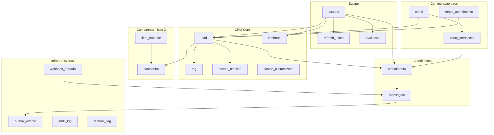

---

## 2. Equipe

```mermaid
erDiagram
    USUARIO ||--o{ REFRESH_TOKEN : possui
    USUARIO ||--o{ AVALIACAO : recebe
    USUARIO ||--o| DISPONIBILIDADE_ATENDENTE_IA : configura
    USUARIO ||--o{ ROTINA_DISPONIBILIDADE_ATENDENTE : atribuido
    ROTINA_DISPONIBILIDADE ||--o{ ROTINA_DISPONIBILIDADE_ATENDENTE : agrupa

    USUARIO {
        uuid id PK
        varchar nome
        varchar email UK
        varchar senha_hash
        enum papel
        enum status_presenca
        boolean ativo
        timestamptz criado_em
    }

    REFRESH_TOKEN {
        uuid id PK
        uuid usuario_id FK
        varchar token_hash UK
        uuid familia
        timestamptz expira_em
        timestamptz revogado_em
    }

    AVALIACAO {
        uuid id PK
        uuid atendimento_id FK UK
        uuid atendente_id FK
        smallint nota
        text comentario
        timestamptz criado_em
    }

    DISPONIBILIDADE_ATENDENTE_IA {
        uuid atendente_id PK
        boolean disponivel_para_ia
        timestamptz atualizado_em
    }

    ROTINA_DISPONIBILIDADE {
        uuid id PK
        enum dia_semana
        varchar nome
        enum tipo
        boolean ativo
    }

    ROTINA_DISPONIBILIDADE_ATENDENTE {
        uuid rotina_id PK
        uuid atendente_id PK
    }

    HORARIO_TRABALHO {
        uuid id PK
        varchar aplicavel_a
        enum dia_semana
        time inicio
        time fim
    }
```

Notas: `papel` é ATENDENTE, SUBGESTOR, GESTOR ou ADMINISTRADOR. `token_hash` guarda SHA-256, nunca o token. Reuso de refresh revoga a `familia` inteira. `horario_trabalho` tem CHECK de `fim > inicio`.

---

## 3. CRM Core

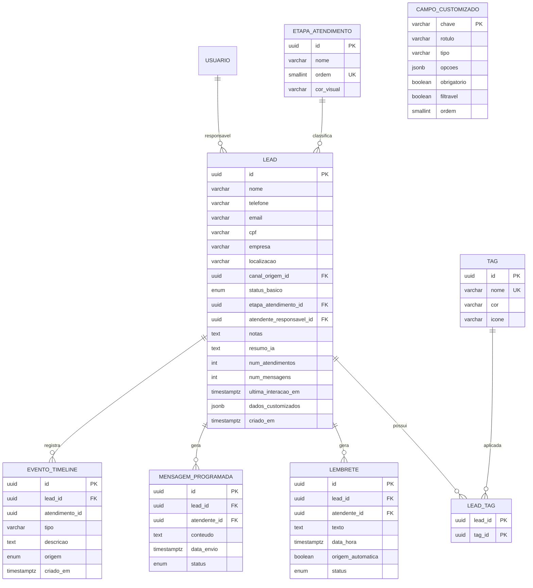

Notas importantes:

- `atendente_responsavel_id` é a base do RLS e da Specification de visibilidade
- `notas`, `resumo_ia` e `dados_customizados` **nunca entram em projeção de listagem**
- `num_atendimentos`, `num_mensagens` e `ultima_interacao_em` são denormalizados, escritos na mesma transação da mensagem. O último usa `GREATEST` para não retroceder em reentrega de webhook
- `campo_customizado` não tem FK para `lead` — guarda só metadados; os valores vivem no JSONB. É a extensibilidade da Base PAI sem nichar o core
- `evento_timeline.atendimento_id` usa `ON DELETE SET NULL`: o histórico do lead sobrevive ao atendimento

---

## 4. Atendimento

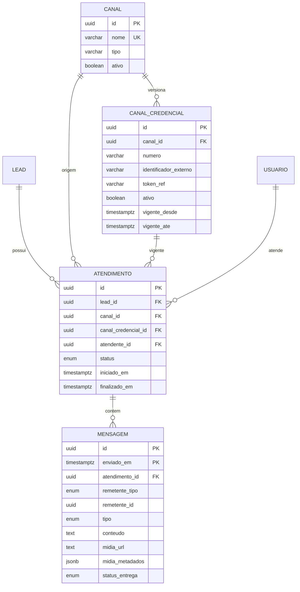

Notas: `mensagem` é particionada por `RANGE (enviado_em)`, com PK composta. `token_ref` é referência ao secret manager, nunca o token. O índice único parcial em `canal_credencial` garante uma credencial ativa por canal; o histórico aponta para a vigente à época, por isso a antiga nunca é deletada.

---

## 5. Infraestrutura transversal

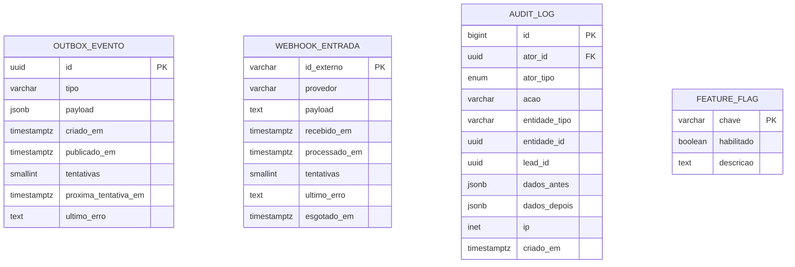

Notas:

- `webhook_entrada.id_externo` como PK **é** a idempotência: reentrega do provedor não duplica mensagem
- `payload` é **TEXT desde a V17**, não JSONB — JSONB normaliza o JSON e a assinatura HMAC deixaria de ser reconferível
- `outbox_evento.publicado_em IS NULL` marca pendente; o índice parcial só varre esses
- `audit_log.lead_id` **não tem FK de propósito** — o log é append-only e precisa sobreviver à exclusão do lead

---

## 6. Fluxo de mensagem — entrada

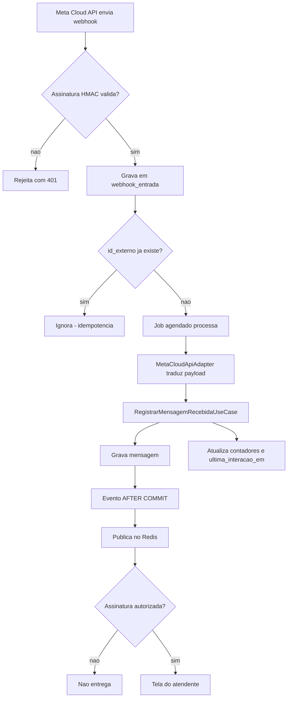

---

## 7. Fluxo de mensagem — saida

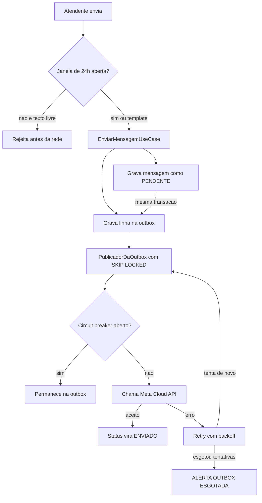

> `mensagem` e `outbox_evento` são gravadas na mesma transação. É o padrão Outbox: publicar fora dela permitiria o estado gravado e o evento perdido.

---

## 8. Ciclo de vida da entrega

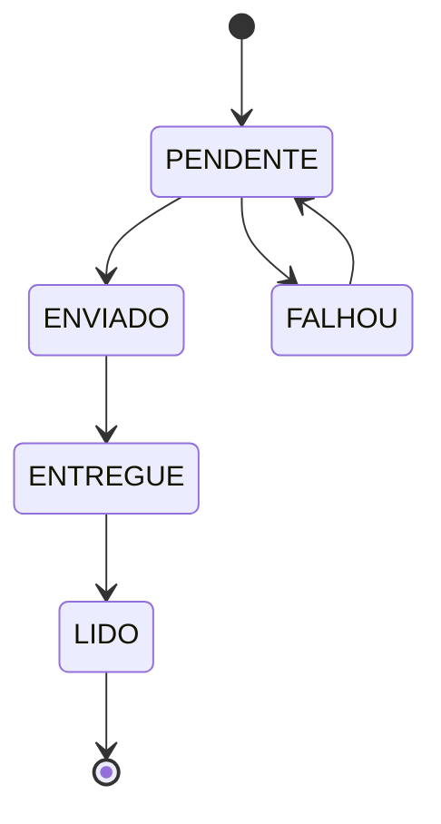

| Estado | Significado | Na tela |
|---|---|---|
| `PENDENTE` | Gravada na transação, provedor ainda não viu | Relógio |
| `ENVIADO` | Provedor aceitou | ✓ |
| `ENTREGUE` | Chegou no aparelho | ✓✓ |
| `LIDO` | Cliente abriu | ✓✓ azul |
| `FALHOU` | Retry esgotado | ⚠ com ação de reenviar |

`FALHOU` precisa ser visível e acionável — um ✓ mentiroso é pior que um erro honesto.

---

## 9. Particionamento de `mensagem`

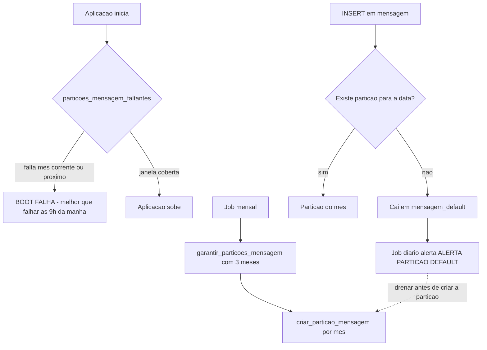

> A `mensagem_default` é rede de segurança de último recurso. Sem ela, um `INSERT` sem partição falharia e o envio pararia — o que a regra de precedência proíbe. Com ela, vira dívida de manutenção recuperável. **Só vale com alarme:** linhas presas ali impedem anexar a partição daquele mês depois.

---

## 10. Decisão de RLS

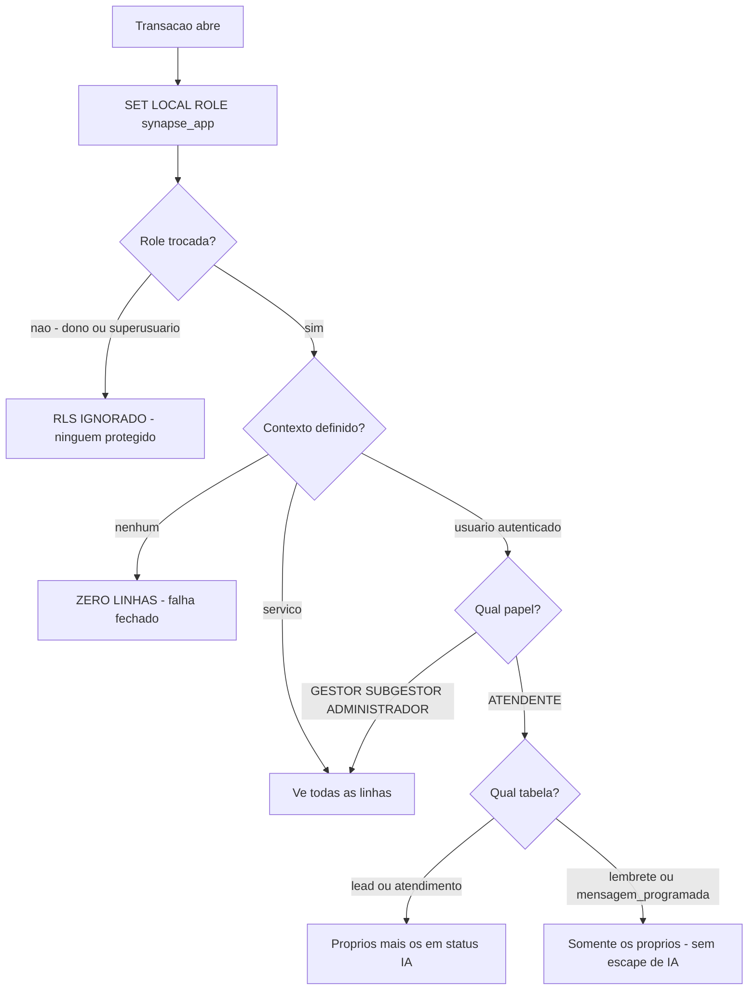

> **`SET LOCAL ROLE` é o que faz tudo funcionar.** Dono de tabela ignora RLS; superusuário ignora inclusive com `FORCE ROW LEVEL SECURITY`. Sem a troca de role as políticas existem e ninguém está protegido — foi o que aconteceu na E02b, e só os testes negativos expuseram.

---

## 11. Campanhas e Automação

Tabelas existem no schema; UI fora da primeira entrega (`docs/09`).

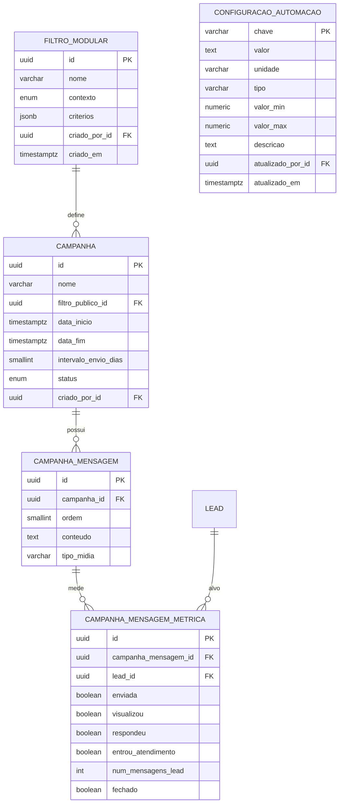

Notas: `criterios` é a árvore AND/OR do filtro modular, com índice GIN. `intervalo_envio_dias` tem CHECK de 1 a 7. `configuracao_automacao` é chave-valor tipado de propósito — parâmetro novo é `INSERT`, não migration nem deploy.

---

## 12. Chat interno *(fase 2)*

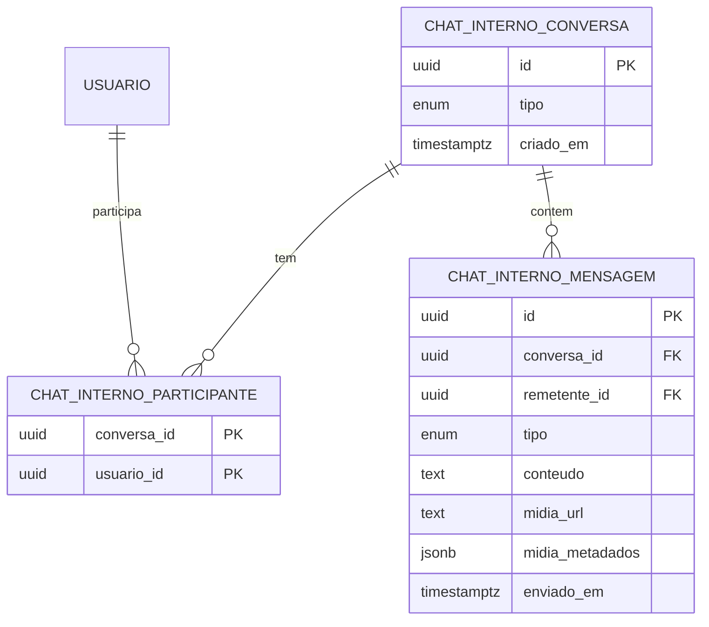
